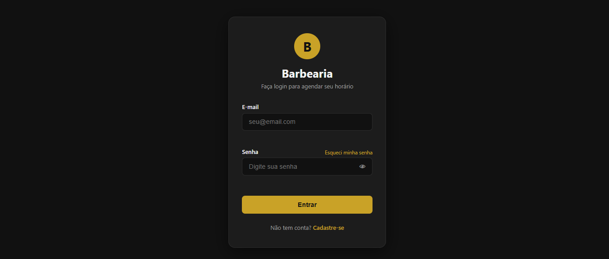
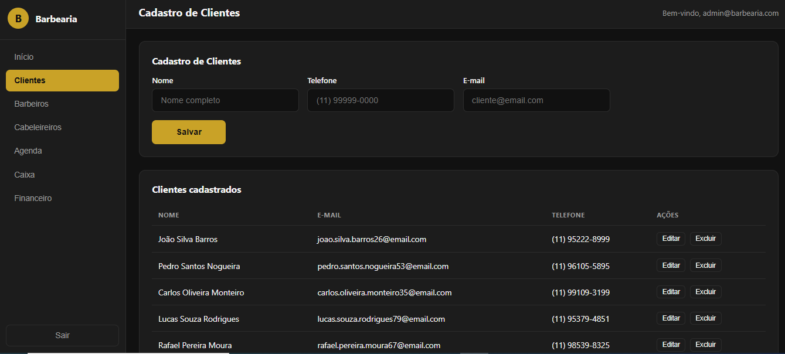
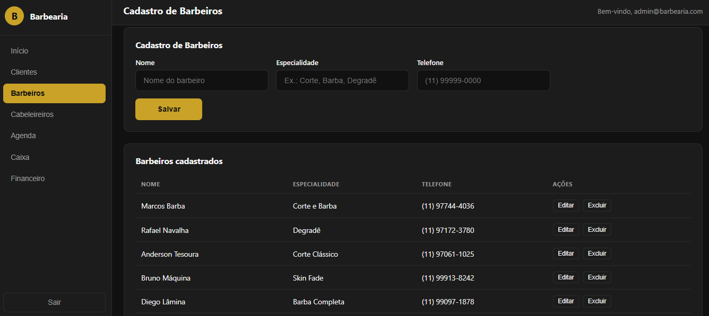
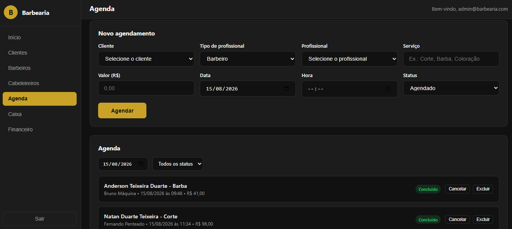
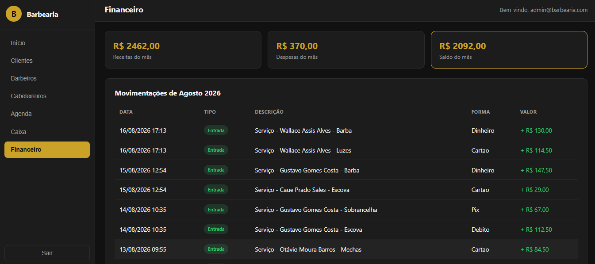
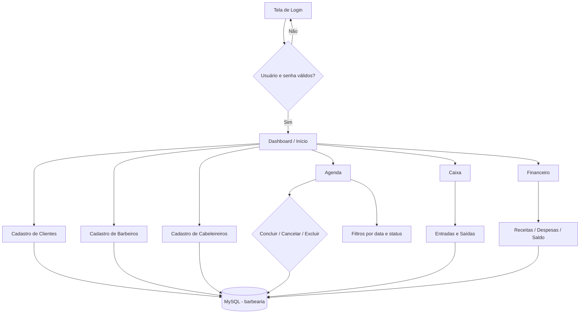
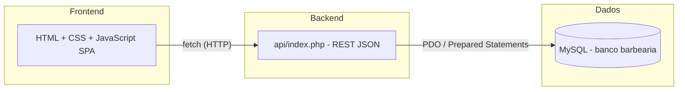

<p align="center">
  
</p>

<h1 align="center">💈 Barbearia — Sistema de Gerenciamento</h1>

<p align="center">
  Sistema web responsivo para gestão completa de barbearias: cadastro de clientes, barbeiros e cabeleireiros, agenda de horários, caixa diário e controle financeiro mensal.
</p>

<p align="center">
  <b>Stack:</b> PHP 8 · MySQL · HTML5 · CSS3 · JavaScript (SPA)
</p>

---

## ✨ Funcionalidades

- 🔐 **Autenticação** — login com e-mail e senha validados no servidor (senhas com hash)
- 👤 **Cadastro de Clientes** — incluir, editar e excluir clientes
- ✂️ **Cadastro de Barbeiros** — profissionais com especialidade
- 💇 **Cadastro de Cabeleireiros** — profissionais com especialidade
- 📅 **Agenda** — agendamentos por cliente, profissional, serviço, data e hora, com filtros e mudança de status (Concluído / Cancelado)
- 💰 **Caixa** — registro de entradas e saídas com formas de pagamento e total do dia
- 📊 **Financeiro** — receitas, despesas e saldo do mês
- 🏠 **Dashboard** — visão geral com totais e próximos agendamentos
- 📱 **Responsivo** — desktop, tablet e celular

---

## 🖥️ Telas do Sistema

| | |
|---|---|
|  |  |
| **Login** — acesso protegido ao painel | **Cadastro de Clientes** — CRUD completo |
|  |  |
| **Barbeiros** — profissionais e especialidades | **Agenda** — horários e status |
|  | |
| **Financeiro** — resumo mensal | |

---

## 🔀 Fluxograma do Sistema



### Visão em camadas



---

## 🧰 Tecnologias Utilizadas

| Camada | Tecnologia |
| ------ | ---------- |
| Frontend | HTML5, CSS3, JavaScript (SPA) |
| Backend | PHP 8 — API REST |
| Banco de dados | MySQL / MariaDB (XAMPP) |
| Servidor local | Apache (XAMPP) |

---

## 🚀 Como Executar

1. Copie o projeto para o diretório do XAMPP:

   ```
   C:\xampp\htdocs\barbearia
   ```

2. No **XAMPP Control Panel**, inicie o **Apache** e o **MySQL**.

3. Crie e popule o banco de dados acessando:

   ```
   http://localhost/barbearia/database/seed.php
   ```

4. Acesse o sistema:

   ```
   http://localhost/barbearia/
   ```

5. Entre com as credenciais de teste:

   | Perfil | E-mail | Senha |
   | ------ | ----------------------- | ------ |
   | Administrador | `admin@barbearia.com` | `123456` |

---

## 📚 Documentação

- [Análise de Requisitos](docs/analise-de-requisitos.md)
- [Tecnologias Utilizadas](docs/tecnologias-utilizadas.md)
- [Arquitetura do Sistema](docs/arquitetura-do-sistema.md)
- [Diagrama do Banco de Dados](docs/diagrama-do-banco-de-dados.md)
- [Credenciais de Teste](docs/credenciais-de-teste.md)
- [Identidade Visual](docs/identidade-visual.md)
- [Tutorial de Uso](docs/tutorial-de-uso.md)

---

## 👨‍💻 Autoria

**Leo Lemos** — desenvolvimento do sistema, banco de dados e documentação.
