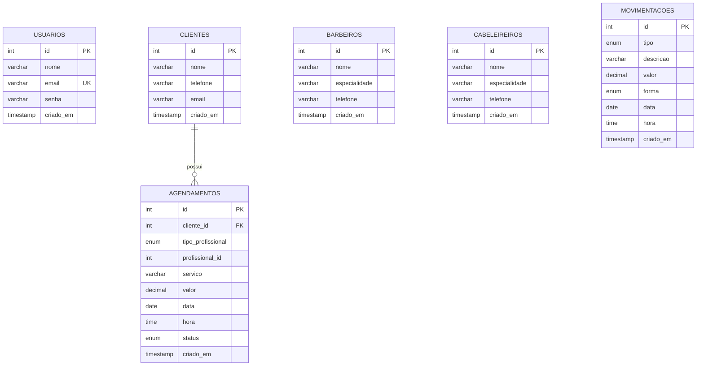

# Diagrama do Banco de Dados

Banco: **`barbearia`** — MySQL, charset `utf8mb4`.

## Diagrama Entidade-Relacionamento

## Descrição das Tabelas

### `usuarios`
| Coluna | Tipo | Observações |
| ------ | ---- | ----------- |
| id | INT | PK, auto incremento |
| nome | VARCHAR(100) | |
| email | VARCHAR(150) | UNIQUE |
| senha | VARCHAR(255) | Hash `password_hash` |
| criado_em | TIMESTAMP | Default `CURRENT_TIMESTAMP` |

### `clientes`
| Coluna | Tipo | Observações |
| ------ | ---- | ----------- |
| id | INT | PK, auto incremento |
| nome | VARCHAR(150) | |
| telefone | VARCHAR(20) | |
| email | VARCHAR(150) | |
| criado_em | TIMESTAMP | |

### `barbeiros`
| Coluna | Tipo | Observações |
| ------ | ---- | ----------- |
| id | INT | PK, auto incremento |
| nome | VARCHAR(150) | |
| especialidade | VARCHAR(150) | |
| telefone | VARCHAR(20) | |
| criado_em | TIMESTAMP | |

### `cabeleireiros`
| Coluna | Tipo | Observações |
| ------ | ---- | ----------- |
| id | INT | PK, auto incremento |
| nome | VARCHAR(150) | |
| especialidade | VARCHAR(150) | |
| telefone | VARCHAR(20) | |
| criado_em | TIMESTAMP | |

### `agendamentos`
| Coluna | Tipo | Observações |
| ------ | ---- | ----------- |
| id | INT | PK, auto incremento |
| cliente_id | INT | FK → `clientes.id` (ON DELETE CASCADE) |
| tipo_profissional | ENUM | `barbeiro` / `cabeleireiro` |
| profissional_id | INT | Refere-se ao id do barbeiro ou cabeleireiro conforme o tipo |
| servico | VARCHAR(150) | |
| valor | DECIMAL(10,2) | Default 0 |
| data | DATE | |
| hora | TIME | |
| status | ENUM | `Agendado` / `Confirmado` / `Concluído` / `Cancelado` |
| criado_em | TIMESTAMP | |

> O campo `profissional_id` é polimórfico: aponta para `barbeiros.id` quando `tipo_profissional = 'barbeiro'` e para `cabeleireiros.id` quando `tipo_profissional = 'cabeleireiro'`.

### `movimentacoes`
| Coluna | Tipo | Observações |
| ------ | ---- | ----------- |
| id | INT | PK, auto incremento |
| tipo | ENUM | `entrada` / `saida` |
| descricao | VARCHAR(255) | |
| valor | DECIMAL(10,2) | |
| forma | ENUM | `Dinheiro` / `Pix` / `Cartão` / `Débito` |
| data | DATE | |
| hora | TIME | |
| criado_em | TIMESTAMP | |

## Relacionamentos

| Relacionamento | Tipo | Descrição |
| -------------- | ---- | --------- |
| clientes → agendamentos | 1:N | Um cliente pode ter vários agendamentos; ao excluir o cliente, os agendamentos são removidos (cascade). |
| barbeiros/cabeleireiros → agendamentos | 1:N (lógico) | Referência polimórfica por `tipo_profissional`. |
